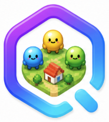
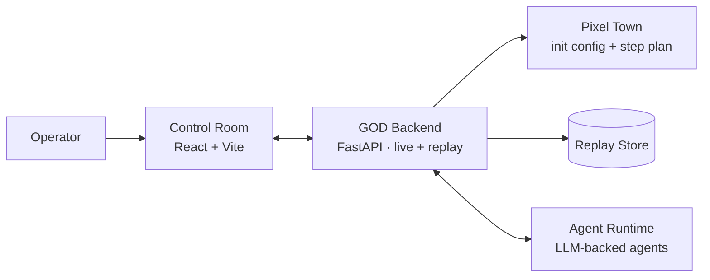

<h1 align="center">
  
  GOD · Govern · Observe · Direct
</h1>

<p align="center">
  
</p>

<p align="center">
  <b>A real-time control room for agent societies.</b><br/>
  Watch a live pixel-town of LLM agents. Ask any of them. Steer the simulation step by step.
</p>

<p align="center">
  <a href="#-quick-start"><b>Quick Start</b></a> ·
  <a href="#-highlights">Highlights</a> ·
  <a href="#-features">Features</a> ·
  <a href="#%EF%B8%8F-how-it-works">How it works</a> ·
  <a href="#%EF%B8%8F-roadmap">Roadmap</a> ·
  <a href="README.zh-CN.md">中文</a>
</p>

<p align="center">
  
  
  
  
  
  
</p>

---

> Most generative-agent projects ship great research and great replays.
> **GOD is the missing operator console** — a single screen where you can pause, ask, intervene, and reset a society of LLM agents while it is alive.

## ✨ Highlights

- 🎮 &nbsp;**Live pixel-town control room** — replay any step, pause, fast-forward, or auto-run.
- 💬 &nbsp;**Ask any agent anything** — targeted questions to one resident or to the whole town, mid-simulation.
- 🎛️ &nbsp;**Direct interventions** — inject new instructions into upcoming steps and watch the agents react.
- 🔄 &nbsp;**One-command reset** — wipe stale replay data and start a clean experiment.
- 🧱 &nbsp;**Local, hackable, single-config** — one `.env`, one script, no Docker required.

## 🖼️ Screenshots

<p align="center">
  
</p>

<p align="center"><sub>Live control room: pixel town, step controls, targeted ask, and resident roster — all in one view.</sub></p>

## 🚀 Quick Start

```bash
git clone https://github.com/<your-org>/GOD.git
cd GOD
./scripts/god.sh start
```

On the first run, GOD asks for three model settings:

| Variable | Example |
| --- | --- |
| `GOD_LLM_API_KEY` | `sk-...` |
| `GOD_LLM_API_BASE` | `https://api.openai.com/v1` |
| `GOD_LLM_MODEL` | `gpt-5.4` |

Any OpenAI-compatible endpoint works. When the stack is ready, open:

```
http://127.0.0.1:5174/pixel-replay/god_town/1
```

Full walkthrough: **[Quickstart →](QUICKSTART.md)**

## 🧩 Features

|     | Feature | Why it matters |
| --- | --- | --- |
| 🎬 | **Replay control** | Scrub a live or recorded experiment by step, pause, auto-run. |
| 💬 | **Targeted ask** | Direct natural-language questions to one agent or to everyone. |
| 🎛️ | **Step interventions** | Inject instructions for the next step; the simulation reacts immediately. |
| 🧼 | **Fresh runs** | One command to wipe a stale run and re-seed a clean simulation. |
| 🗺️ | **Pixel town world** | Locations, actions, messages, and agent status, all replay-friendly. |
| 🛠️ | **Single config** | One `.env`, one script, sane defaults. |

## 🏗️ How It Works



| Layer | What it does |
| --- | --- |
| **Control Room** | React/Vite UI for replay, ask, intervention, and status. |
| **Backend** | Local FastAPI service exposing live and replay APIs. |
| **Pixel Town** | Replay-friendly social world: locations, actions, messages, agent status. |
| **Agent Runtime** | Out-of-process LLM agents reached over a local WebSocket. |

## ⚙️ Commands

```bash
./scripts/god.sh start      # start the full stack (idempotent)
./scripts/god.sh new-run    # wipe replay data and start a fresh session
./scripts/god.sh status     # ports, URLs, model status
./scripts/god.sh stop       # stop everything
./scripts/god.sh tail       # follow logs
./scripts/god.sh open       # open the control room in the default browser
```

## 🧪 Default Experiment

```text
god_town
├── 10 residents with distinct personas
├── A pixel town: houses, paths, and a town square
└── A scripted step plan you can intervene at any point
```

To run your own experiment, drop a new config under `quick_experiments/` and point `GOD_EXPERIMENT` at it.

## 🛣️ Roadmap

- [ ] Multi-town experiments in one control room
- [ ] Persistent operator notes per step
- [ ] Pluggable map manifests
- [ ] Hosted public demo

Have an idea? Open an issue or PR — see [Contributing](#-contributing).

## 🤝 Contributing

Issues and pull requests are very welcome. To set up a dev environment:

```bash
./scripts/god.sh start
```

That installs Python and Node dependencies, brings up the full stack, and opens a live session. From there, edit and reload.

## 🙌 Acknowledgements

GOD stands on the shoulders of open research and open-source. It bundles two trimmed, integrated upstream checkouts:

- [AgentSociety](https://github.com/tsinghua-fib-lab/AgentSociety) — large-scale generative-agent simulation framework.
- [JiuwenClaw](https://github.com/openJiuwen-ai/jiuwenclaw) — out-of-process agent runtime.

And takes inspiration from [Generative Agents](https://arxiv.org/abs/2304.03442) and [OASIS](https://github.com/camel-ai/oasis).

## 📚 Citation

```bibtex
@article{piao2025agentsociety,
  title   = {AgentSociety: Large-Scale Simulation of LLM-Driven Generative Agents Advances Understanding of Human Behaviors and Society},
  author  = {Piao et al.},
  journal = {arXiv preprint arXiv:2502.08691},
  year    = {2025}
}

@misc{park2023generativeagents,
  title         = {Generative Agents: Interactive Simulacra of Human Behavior},
  author        = {Joon Sung Park and Joseph C. O'Brien and Carrie J. Cai and Meredith Ringel Morris and Percy Liang and Michael S. Bernstein},
  year          = {2023},
  eprint        = {2304.03442},
  archivePrefix = {arXiv},
  primaryClass  = {cs.HC},
  url           = {https://arxiv.org/abs/2304.03442}
}
```

## ⭐ Star History

<a href="https://star-history.com/#your-org/GOD&Date">
  <picture>
    <source media="(prefers-color-scheme: dark)" srcset="https://api.star-history.com/svg?repos=your-org/GOD&type=Date&theme=dark" />
    <source media="(prefers-color-scheme: light)" srcset="https://api.star-history.com/svg?repos=your-org/GOD&type=Date" />
    
  </picture>
</a>

## 📄 License

Released under the [Apache-2.0](LICENSE) license. Upstream LICENSE and NOTICE files are kept inside the integrated runtime checkouts and apply to those subtrees.

<p align="center"><sub>Built with care. ⭐ a star helps GOD grow.</sub></p>
