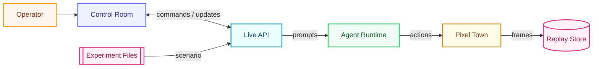
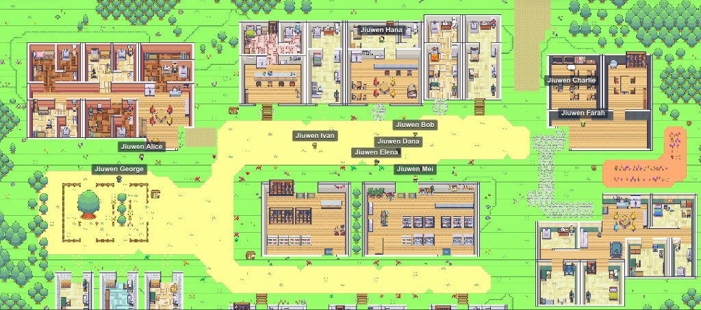
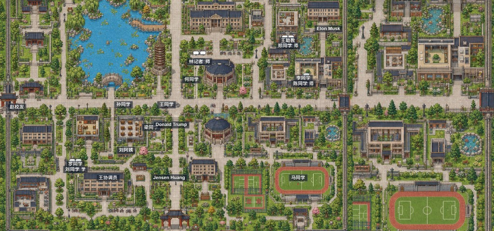

<h1 align="center">
  
  &nbsp;GOD · Govern · Observe · Direct
</h1>

<p align="center">
  
</p>
<p align="center">
  <b>🌩️ Be like a god to a town of agents.</b><br/>
  Pause time. Whisper to a soul. Bend the next step. Reset the world — all from a single click.
</p>


<p align="center">
  <a href="#-quick-start"><b>🚀 Quick Start</b></a> ·
  <a href="#-highlights">Highlights</a> ·
  <a href="#-features">Features</a> ·
  <a href="#%EF%B8%8F-how-it-works">How it works</a> ·
  <a href="#-built-in-experiments">Built-in Experiments</a> ·
  <a href="https://xiaoluolyg.github.io/GOD/">Scenarios</a> ·
  <a href="https://xiaoluolyg.github.io/GOD/developer/">Developer Docs</a> ·
  <a href="#-updates">Updates</a> ·
  <a href="#%EF%B8%8F-roadmap">Roadmap</a> ·
  <a href="CONTRIBUTING.md">Contributing</a> ·
  <a href="README.zh-CN.md">🌏 中文</a>
</p>

<p align="center">
  
  
  
  
  
  
  
</p>

---

> Other generative-agent projects let you **watch**.
> **GOD lets you reign.**
>
> One screen. Pause time. Question any soul. Rewrite the next step. Restart the world.
> The missing operator console for a society of agents — alive while you steer it.

## ✨ Highlights

<table>
<tr>
  <td align="center" width="20%">⏯️<br/><b>Pause time</b><br/><sub>Stop, scrub, fast-forward, auto-play any live step.</sub></td>
  <td align="center" width="20%">💬<br/><b>Whisper to anyone</b><br/><sub>Ask one resident, a group, or the whole town — mid-run.</sub></td>
  <td align="center" width="20%">🎛️<br/><b>Bend the next step</b><br/><sub>Inject instructions and watch agents react in real time.</sub></td>
  <td align="center" width="20%">🪄<br/><b>No-code setup</b><br/><sub>Configure model, scenario and agents from a browser wizard.</sub></td>
  <td align="center" width="20%">🔄<br/><b>Reset reality</b><br/><sub>One command wipes a stale run and re-seeds a clean world.</sub></td>
</tr>
</table>

## 🖼️ Screenshots

<p align="center">
  
</p>

<p align="center"><sub>Live control room — PKU map, step controls, targeted ask, and resident roster in one view.</sub></p>

## 🚀 Quick Start

```bash
git clone https://github.com/XiaoLuoLYG/GOD.git
cd GOD
./scripts/god.sh start
```

Windows PowerShell: from the repo root, run `.\scripts\god.cmd start`.

That's it. On first run, the script installs everything, opens a **browser-based setup wizard**, and waits for you. No `.env` editing, no command-line flags, no glue scripts.

<p align="center">
  
</p>


<p align="center"><sub>The Setup Wizard — model config, experiment choice, and custom society creation from one browser flow.</sub></p>

<table>
<tr>
  <td align="center" width="16%">🔌<br/><b>1. Model</b><br/><sub>Paste an OpenAI-compatible API key, base URL, and model name.</sub></td>
  <td align="center" width="16%">🧭<br/><b>2. Choose</b><br/><sub>Open GOD Town, open PKU Trump Visit, or create your own.</sub></td>
  <td align="center" width="16%">🧪<br/><b>3. Scenario</b><br/><sub>Describe your world — date, weather, vibes, rules.</sub></td>
  <td align="center" width="16%">🤖<br/><b>4. Generate</b><br/><sub>The GOD agent drafts agent profiles and a step plan.</sub></td>
  <td align="center" width="16%">✏️<br/><b>5. Edit</b><br/><sub>Tweak personalities, relationships, locations, or steps.</sub></td>
  <td align="center" width="16%">▶️<br/><b>6. Launch</b><br/><sub>Publish the experiment and step into the control room.</sub></td>
</tr>
</table>

Any OpenAI-compatible endpoint works. When the wizard hands off, the script prints a URL like:

```text
http://127.0.0.1:5174/pixel-replay/god_town/1
```

Full walkthrough: **[Quickstart →](QUICKSTART.md)**

## 🧩 Features

|     | Feature | What you get |
| --- | --- | --- |
| 🎬 | **Replay control** | Scrub a live or recorded run by step. Pause, jump, auto-play. |
| 💬 | **Targeted ask** | Send a natural-language question to one agent, a group, or the whole town. |
| 🎛️ | **Real-time intervention** | Inject instructions into the *next* step — the agents read them on their next turn. |
| ⌨️ | **Command composer** | Type `/ask` or `/intervene`, use `@Name #id` completions, and send operator commands without leaving the map. |
| 🪄 | **No-code setup wizard** | Browser-based: configure model + scenario, let GOD generate agents and steps, edit, then launch. |
| 🧬 | **Agent Studio** | Add or edit residents through a map-aware wizard for seed, identity, appearance, personality, routine, and review. |
| 🧭 | **Map Studio** | Generate or upload a map draft, calibrate locations and collisions, validate it, then publish it as a local map package. |
| 🧼 | **One-command reset** | Wipe replay data and seed a clean society without leaving the terminal. |
| 🗺️ | **Pixel town world** | A live tiled map: locations, actions, messages, statuses — every step replay-friendly. |
| 🧱 | **Single current experiment** | `.env` stores local model/port settings; `.god/current_experiment.json` stores the one active experiment. |

## 🏗️ How It Works



GOD is intentionally local-first: the control room, backend, runtime bridge, experiment files, and replay store all run on your machine. The model endpoint is the only external service you choose.

| Layer | What it does |
| --- | --- |
| 🎮 **Control Room** | React/Vite browser UI — replay, ask, intervention, status. |
| ⚙️ **Backend** | Local FastAPI service exposing live and replay APIs. |
| 🗺️ **Pixel Town** | Replay-friendly social world: locations, actions, messages, agent status. |
| 🤖 **Agent Runtime** | Out-of-process LLM agents reached over a local WebSocket. |

## ⚙️ Commands

```bash
./scripts/god.sh start      # start the full stack (idempotent)
./scripts/god.sh configure  # open setup to switch defaults or create an experiment
./scripts/god.sh restart    # stop everything cleanly, then start again
./scripts/god.sh new-run    # wipe the current experiment run and start fresh
./scripts/god.sh status     # ports, URLs, model status
./scripts/god.sh stop       # stop everything
./scripts/god.sh tail       # follow logs
./scripts/god.sh open       # open the frontend pages in the default browser
```

On Windows, replace `./scripts/god.sh` with `.\scripts\god.cmd`.

## 🧪 Built-in Experiments

GOD ships two built-in experiments and treats them exactly like experiments you publish yourself. The setup wizard writes the selected experiment to `.god/current_experiment.json`; `start`, `open`, and `new-run` then act only on that current experiment.

`.env` is intentionally local-only and only stores model, API, port, and similar machine settings. It no longer decides the default experiment or map, so an old `GOD_MAP_ID=pku` cannot make GOD Town load the PKU map.


### 🏘️ An ordinary weekday in The Ville

A late-spring Tuesday morning at 8:20. Sunny, 18°C, light breeze. A 200-person town with **10 residents who know each other but don't live in each other's pockets** — a slice-of-life simulation, not a quest script.

➡️ **Choose `god_town` in the Setup Wizard to make this the current experiment.** It is bound to `hypothesis_god_town/experiment_1` and the `the_ville` map.

➡️ See [`hypothesis_god_town/experiment_1/`](agentsociety/quick_experiments/hypothesis_god_town/experiment_1/README.md) for the full breakdown of locations, profiles, and interactions.

<p align="center">
  
</p>

<p align="center"><sub>The Ville — all 10 residents going about a typical day across home, school, library, cafe, park, market, pharmacy, pub, and dorm.</sub></p>

<table>
<tr><td colspan="5" align="center"><b>🗺️ 10 Locations · 65 location-scoped interactions</b></td></tr>
<tr>
  <td align="center" width="20%">🏠<br/><b>Home</b><br/><sub>cook · sleep · tidy · read · WFH · video-call</sub></td>
  <td align="center" width="20%">🏫<br/><b>School</b><br/><sub>attend / teach class · grade · office hours</sub></td>
  <td align="center" width="20%">📚<br/><b>Library</b><br/><sub>read · study · research · borrow / return</sub></td>
  <td align="center" width="20%">☕<br/><b>Hobbs Cafe</b><br/><sub>light meal · coffee chat · cafe shift · meetup</sub></td>
  <td align="center" width="20%">🌳<br/><b>Johnson Park</b><br/><sub>walk · meet · exercise · public announcement</sub></td>
</tr>
<tr>
  <td align="center" width="20%">🛠️<br/><b>Supply Store</b><br/><sub>repair · restock · lend tools · customer service</sub></td>
  <td align="center" width="20%">🛒<br/><b>Market</b><br/><sub>buy food · haggle · deliver · chat w/ regulars</sub></td>
  <td align="center" width="20%">💊<br/><b>Pharmacy</b><br/><sub>buy medicine · refill · check BP · home visit prep</sub></td>
  <td align="center" width="20%">🍻<br/><b>Pub</b><br/><sub>socialize · watch match · host small event</sub></td>
  <td align="center" width="20%">🛏️<br/><b>Dorm</b><br/><sub>rest · self-study · common-room hangout · video call</sub></td>
</tr>
</table>

<table>
<tr><td colspan="5" align="center"><b>👥 10 residents — each with a real life</b></td></tr>
<tr>
  <td align="center" width="20%">🧭<br/><b>Alice</b> · 34<br/><sub>Neighborhood coordinator</sub></td>
  <td align="center" width="20%">🛠️<br/><b>Bob</b> · 45<br/><sub>Supply-store shopkeeper</sub></td>
  <td align="center" width="20%">📖<br/><b>Charlie</b> · 39<br/><sub>High-school history teacher</sub></td>
  <td align="center" width="20%">💊<br/><b>Dana</b> · 41<br/><sub>Pharmacy nurse</sub></td>
  <td align="center" width="20%">☕<br/><b>Elena</b> · 36<br/><sub>Cafe owner</sub></td>
</tr>
<tr>
  <td align="center" width="20%">🎒<br/><b>Farah</b> · 16<br/><sub>High-school student</sub></td>
  <td align="center" width="20%">📮<br/><b>George</b> · 68<br/><sub>Retired postman</sub></td>
  <td align="center" width="20%">💻<br/><b>Hana</b> · 28<br/><sub>Remote software engineer</sub></td>
  <td align="center" width="20%">🦺<br/><b>Ivan</b> · 52<br/><sub>Public-safety volunteer</sub></td>
  <td align="center" width="20%">🍅<br/><b>Mei</b> · 47<br/><sub>Market vegetable vendor</sub></td>
</tr>
</table>

<sub>Every resident carries a full profile: age, family, housing, economic status, health, daily routine, skills, needs, worries, secrets, social network, language style, quirks, short- & long-term goals.</sub>

### 🏫 PKU Trump Visit

A campus public-situation experiment on a stylized PKU map. Daily routines begin around gates, classrooms, library, lake, dining hall, dormitory, and Centennial Hall, then a high-attention visit event tests how residents notice, ask, gather, and react.

➡️ **Choose `pku_trump_visit` in the Setup Wizard to make this the current experiment.** It is bound to `hypothesis_pku_trump_visit/experiment_1` and the `pku` map.

➡️ See [`hypothesis_pku_trump_visit/experiment_1/`](agentsociety/quick_experiments/hypothesis_pku_trump_visit/experiment_1/README.md) for the full scenario, cast, operator notes, and replay data.

<p align="center">
  
</p>

<p align="center"><sub>PKU campus map — gates, classrooms, library, Weiming Lake, Boya Pagoda, dining hall, dorm, and Centennial Hall, with named residents and the Trump-visit cast.</sub></p>

## 🗺️ Pluggable Map Packages

GOD now discovers map packages automatically from `agentsociety/custom/maps/<map_id>/`. To add a map, copy [`agentsociety/custom/maps/_template/`](agentsociety/custom/maps/_template/), replace `map.yaml`, `visuals/map.json`, tileset PNGs, and optional `characters/` or `location_assets/`, then run:

```bash
cd agentsociety
uv run python scripts/validate_map_package.py custom/maps/<map_id>
```

The setup wizard will list valid packages without code changes. v1 supports Tiled JSON maps with PNG tilesets and a `Collisions` layer where `0` means walkable. The PKU campus package now ships in the repository at `agentsociety/custom/maps/pku/`. See [docs/MAP_PACKAGES.md](docs/MAP_PACKAGES.md) for the full package contract.

## 🗓️ Updates

Supported feature updates:

- **2026-05-22 · Runtime localization · [#26](https://github.com/XiaoLuoLYG/GOD/pull/26)** — replay, setup, map metadata, locations, actions, statuses, emotions, group labels, and system event templates now switch cleanly between English and Chinese while preserving free-form agent content.
- **2026-05-23 · Control Room command UI · [#27](https://github.com/XiaoLuoLYG/GOD/pull/27)** — PixelReplay now uses a full-height map with a right-side rail, Summary/Chat/Residents/Live Console tabs, and a map-embedded `/ask` + `/intervene` command composer with mention completion.
- **2026-05-24 · Agent Studio wizard · [#28](https://github.com/XiaoLuoLYG/GOD/pull/28)** — Agent Builder and Setup drafts share a map-bound Studio flow for seed, identity, appearance, personality, daily setup, review, and structured agent metadata.
- **2026-05-25 · Strict sprite pipeline · [#29](https://github.com/XiaoLuoLYG/GOD/pull/29)** — Agent Studio can generate validated map-compatible sprites, preserve existing profile text, enforce clean IDs/config sync, and keep generated `Generated_Agent_*.png` files local by default.
- **2026-05-26 · Agent runtime wiring · [#30](https://github.com/XiaoLuoLYG/GOD/pull/30)** — Agents now use the sames skill runtime consistently across AgentBuilder, setup drafts, imports, applies, and default experiment configs.
- **2026-05-27 · Map Studio · [#31](https://github.com/XiaoLuoLYG/GOD/pull/31)** — GOD now includes a Map Studio for generating or uploading local map drafts, configuring image generation, calibrating anchors/collisions, validating packages, publishing them, and returning to Setup with the new `map_id` selected.

## 🛣️ Roadmap

### ✅ Completed

- [x] 🗺️ **Pluggable map packages** — drop a folder under `agentsociety/custom/maps/<map_id>/`, refresh the wizard, and a new world is selectable. Auto-discovered, validated, hot-swappable. See [`docs/MAP_PACKAGES.md`](docs/MAP_PACKAGES.md).
- [x] 🏫 **PKU campus map** — the PKU map package is bundled as a first-class map alongside The Ville.
- [x] 🪄 **No-code setup wizard** — browser flow for model setup, built-in experiment choice, custom experiment generation/editing, and launch.
- [x] 🧪 **Scripted experiments** — reproducible experiments ship as plain folders under `quick_experiments/<hypothesis>/<experiment>/`; choosing or publishing one makes it the current experiment.
- [x] 🎮 **Control Room command rail** — replay controls, resident roster, live console, targeted Ask, and Intervene now live in one map-first operator surface.
- [x] 🧬 **Agent Studio v1** — map-aware add/edit flow with structured profile metadata, ID validation, setup integration, and sprite generation support.
- [x] 🧭 **Map Studio v1** — prompt/reference-image map draft generation, anchor and collision calibration, package validation, publishing, and Setup handoff.
- [x] 🌏 **Bilingual runtime UI** — English/Chinese UI and runtime-owned labels for setup, replay, maps, statuses, actions, and system events.
- [x] 🔌 **Agent skill-runtime path** — the shipped JiuwenClaw agent adapter now uses the AgentSociety skill runtime as the canonical execution path.

### 🛣️ Not Yet Done

- [ ] 🤖 **Pluggable agent runtimes** — swap LLM runtimes and persona templates as cleanly as we now swap maps.
- [ ] 🧪 **Multi-experiment orchestration** — run experiments, control groups, repeats, and ablations side-by-side.
- [ ] 🗺️ **Live map generation** — maps that evolve with events, repairs, blockages, and crowds.
- [ ] 🌦️ **Event-responsive worlds** — weather, accidents, festivals, rumors, shortages, repairs, blockages, and crowds that change agent behavior over time.
- [ ] 🌐 **Large-scale simulation** — AgentSociety batching, sharded runs, sampled replay, and performance-minded replay summaries.
- [ ] 📊 **Experiment evaluation** — cross-run metrics, behavior diffs, intervention effect analysis.
- [ ] 📝 **Operator workflow** — per-step notes, tags, bookmarks, key-event summaries.
- [ ] 🌍 **Hosted demo & scenario sharing** — public demo, experiment/map templates, and one-click import/export for community scenarios.

Have an idea? [Open an issue or PR](#-contributing).

## 🤝 Contributing

Issues and pull requests are very welcome. To set up a dev environment:

```bash
./scripts/god.sh start
```

That installs Python and Node dependencies, brings up the full stack, creates a live session, and runs the first step so the control room opens on a populated town. From there, edit and reload.

Full guide: **[CONTRIBUTING.md →](CONTRIBUTING.md)** — branching, PR checklist, style, and how to ship a new map or experiment.

## 🙌 Acknowledgements

GOD stands on the shoulders of open research and open-source. It bundles two trimmed, integrated upstream checkouts:

- [AgentSociety](https://github.com/tsinghua-fib-lab/AgentSociety) — large-scale generative-agent simulation framework.
- [JiuwenClaw](https://github.com/openJiuwen-ai/jiuwenclaw) — out-of-process agent runtime.

And takes inspiration from [Generative Agents](https://arxiv.org/abs/2304.03442) and [OASIS](https://github.com/camel-ai/oasis).

## 📚 Citation

```bibtex
@article{piao2025agentsociety,
  title   = {AgentSociety: Large-Scale Simulation of LLM-Driven Generative Agents Advances Understanding of Human Behaviors and Society},
  author  = {Piao et al.},
  journal = {arXiv preprint arXiv:2502.08691},
  year    = {2025}
}

@misc{park2023generativeagents,
  title         = {Generative Agents: Interactive Simulacra of Human Behavior},
  author        = {Joon Sung Park and Joseph C. O'Brien and Carrie J. Cai and Meredith Ringel Morris and Percy Liang and Michael S. Bernstein},
  year          = {2023},
  eprint        = {2304.03442},
  archivePrefix = {arXiv},
  primaryClass  = {cs.HC},
  url           = {https://arxiv.org/abs/2304.03442}
}
```

## ⭐ Star History

<a href="https://star-history.com/#XiaoLuoLYG/GOD&Date">
  <picture>
    <source media="(prefers-color-scheme: dark)" srcset="https://api.star-history.com/svg?repos=XiaoLuoLYG/GOD&type=Date&theme=dark" />
    <source media="(prefers-color-scheme: light)" srcset="https://api.star-history.com/svg?repos=XiaoLuoLYG/GOD&type=Date" />
    
  </picture>
</a>

## 📄 License

Released under the [Apache-2.0](LICENSE) license. Upstream LICENSE and NOTICE files are kept inside the integrated runtime checkouts and apply to those subtrees.

<p align="center"><sub>Built with care. ⭐ a star helps GOD grow.</sub></p>
