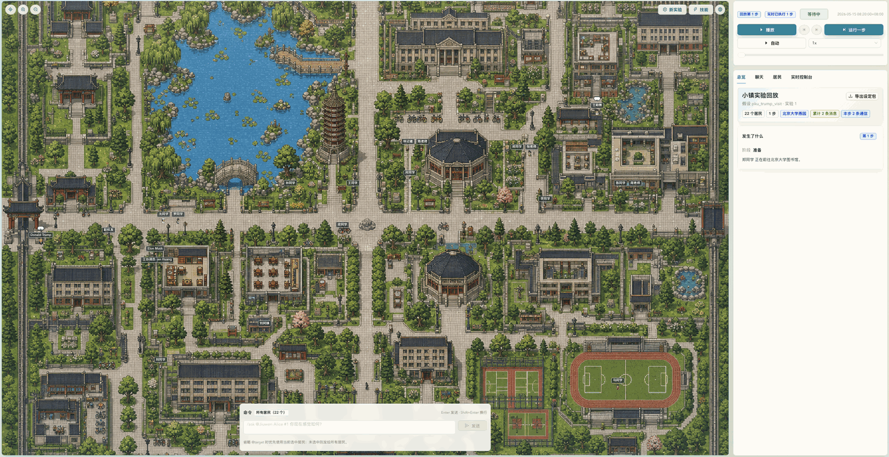
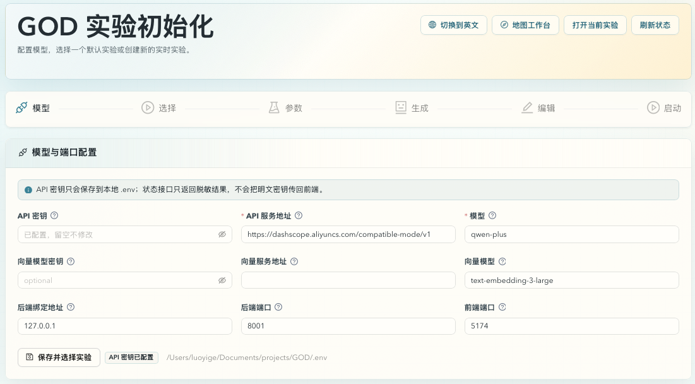
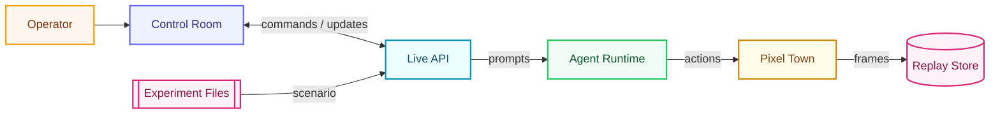

<h1 align="center">
  
  &nbsp;GOD · Govern · Observe · Direct
</h1>

<p align="center">
  
</p>
<p align="center">
  <b>🌩️ 像上帝一样，俯瞰一座由 Agent 组成的小镇。</b><br/>
  暂停时间。操控环境。对某个灵魂发问。一键重置 —— 全部在一个屏幕里完成。
</p>


<p align="center">
  <a href="#-快速开始"><b>🚀 快速开始</b></a> ·
  <a href="#-亮点">亮点</a> ·
  <a href="#-核心能力">核心能力</a> ·
  <a href="#%EF%B8%8F-架构">架构</a> ·
  <a href="#-内置实验">内置实验</a> ·
  <a href="#%EF%B8%8F-roadmap">Roadmap</a> ·
  <a href="CONTRIBUTING.zh-CN.md">参与开发</a> ·
  <a href="README.md">🌏 English</a>
</p>

<p align="center">
  
  
  
  
  
  
  
</p>

---

> 别的 generative-agent 项目只让你 **观察**。
> **GOD 让你掌控一切**
>
> 一个屏幕。暂停时间。灵魂发问。操控环境。重启世界。
> 它是缺失的那一层操作台 —— 让一座 Agent 社会在你手中实时运转。

## ✨ 亮点

<table>
<tr>
  <td align="center" width="20%">⏯️<br/><b>暂停时间</b><br/><sub>任意 step replay、暂停、加速、自动推进。</sub></td>
  <td align="center" width="20%">💬<br/><b>对任意人耳语</b><br/><sub>在 live session 里向某个居民、群组或全镇发问。</sub></td>
  <td align="center" width="20%">🎛️<br/><b>改写下一步</b><br/><sub>注入指令，Agent 在下一回合立刻响应。</sub></td>
  <td align="center" width="20%">🪄<br/><b>零代码上手</b><br/><sub>浏览器配置向导：模型、剧本、Agent 一站搞定。</sub></td>
  <td align="center" width="20%">🔄<br/><b>重启世界</b><br/><sub>一条命令清掉旧数据，重新孵化一座干净的小镇。</sub></td>
</tr>
</table>

## 🖼️ 截图

<p align="center">
  
</p>

<p align="center"><sub>实时控制台：PKU 地图、step 控制、定向提问、居民列表 —— 全在一个界面里。</sub></p>

## 🚀 快速开始

```bash
git clone https://github.com/XiaoLuoLYG/GOD.git
cd GOD
./scripts/god.sh start
```

就这么简单。首次启动会自动装好依赖，打开 **浏览器中的实验配置向导**，然后等你完成。不用改 `.env`、不用命令行参数、不用胶水脚本。

<p align="center">
  
</p>

<p align="center"><sub>实验配置向导 —— 模型配置、默认实验选择、自建实验发布都在同一个浏览器流程里。</sub></p>

<table>
<tr>
  <td align="center" width="16%">🔌<br/><b>1. 模型</b><br/><sub>填入 OpenAI 兼容的 API key、base URL 和模型名。</sub></td>
  <td align="center" width="16%">🧭<br/><b>2. 选择</b><br/><sub>打开 GOD Town、打开 PKU Trump Visit，或新建实验。</sub></td>
  <td align="center" width="16%">🧪<br/><b>3. 剧本</b><br/><sub>用自然语言描述世界：日期、天气、氛围、规则。</sub></td>
  <td align="center" width="16%">🤖<br/><b>4. 生成</b><br/><sub>GOD agent 自动起草 agent profile 和 step 计划。</sub></td>
  <td align="center" width="16%">✏️<br/><b>5. 编辑</b><br/><sub>调整人物性格、关系、地点、步骤。</sub></td>
  <td align="center" width="16%">▶️<br/><b>6. 启动</b><br/><sub>发布为当前实验，直接进入控制台。</sub></td>
</tr>
</table>

任意 OpenAI 兼容接口都可以。向导收尾后，脚本会打印类似这样的地址：

```text
http://127.0.0.1:5174/pixel-replay/god_town/1
```

完整步骤见 **[快速开始 →](QUICKSTART.zh-CN.md)**

## 🧩 核心能力

|     | 能力 | 你得到什么 |
| --- | --- | --- |
| 🎬 | **Replay 控制** | 按 step 拖动、暂停、跳转、自动推进，live 或 replay 都行。 |
| 💬 | **定向提问** | 用自然语言向某个 Agent、某组人或全镇提问。 |
| 🎛️ | **实时干预** | 给即将执行的 step 注入指令，Agent 下一回合就读得到。 |
| 🪄 | **零代码配置向导** | 浏览器里配置模型 + 剧本，让 GOD 生成 Agent 和 step，编辑后启动。 |
| 🧼 | **一键重开** | 一条命令清掉 replay 数据，孵化一座干净的小镇。 |
| 🗺️ | **像素小镇世界** | 地点、动作、消息、状态都是结构化、replay 友好的。 |
| 🧱 | **唯一当前实验** | `.env` 只保存模型、API、端口等本机配置；`.god/current_experiment.json` 保存唯一 active 实验。 |

## 🏗️ 架构



GOD 是 local-first：控制台、后端、runtime bridge、实验文件和 replay store 都运行在本机。唯一外部服务是你选择的模型接口。

| 层 | 职责 |
| --- | --- |
| 🎮 **Control Room** | React/Vite 控制台 —— replay、ask、intervention、status 都在这里。 |
| ⚙️ **Backend** | 本地 FastAPI，提供 live 和 replay API。 |
| 🗺️ **Pixel Town** | 像素小镇社会状态：地点、动作、消息、Agent 状态。 |
| 🤖 **Agent Runtime** | 独立进程的 LLM Agent，通过本地 WebSocket 连接。 |

## ⚙️ 常用命令

```bash
./scripts/god.sh start      # 启动完整栈（可重复执行）
./scripts/god.sh configure  # 打开配置向导，切换默认实验或新建实验
./scripts/god.sh restart    # 先干净停止，再重新启动
./scripts/god.sh new-run    # 清空当前实验 run，并开一个新的 session
./scripts/god.sh status     # 查看端口、URL、模型状态
./scripts/god.sh stop       # 停止所有服务
./scripts/god.sh tail       # 跟随日志
./scripts/god.sh open       # 在浏览器里打开前端页面
```

## 🧪 内置实验

GOD 现在内置两个默认实验，并且和你自己发布的实验使用同一套 current model。配置向导会把你选择的实验写到 `.god/current_experiment.json`；之后 `start`、`open`、`new-run` 都只作用于这个当前实验。

`.env` 只保存本机模型、API、端口等配置，不再决定默认实验或地图。因此即使旧 `.env` 里残留 `GOD_MAP_ID=pku`，选择 GOD Town 时仍然会使用 `the_ville` 地图，不会串台。


### 🏘️ The Ville 的一个普通工作日

晚春的工作日清晨 8:20，晴朗微风，气温 18°C。一座 200 多人的小镇，**10 位常住居民彼此熟识但保持距离** —— 一段反映自然节奏的日常切片，不是任务驱动的剧本。

➡️ **在配置向导选择 `god_town` 即可把它设为当前实验。** 它固定绑定 `hypothesis_god_town/experiment_1` 和 `the_ville` 地图。

➡️ 完整的地点 / 居民 / 交互拆解见 [`hypothesis_god_town/experiment_1/`](agentsociety/quick_experiments/hypothesis_god_town/experiment_1/README.md)。

<table>
<tr><td colspan="5" align="center"><b>🗺️ 10 个地点 · 65 个 location-scoped 交互</b></td></tr>
<tr>
  <td align="center" width="20%">🏠<br/><b>家</b><br/><sub>做饭 · 睡觉 · 整理 · 阅读 · 居家办公 · 视频家人</sub></td>
  <td align="center" width="20%">🏫<br/><b>学校</b><br/><sub>上课 / 教书 · 批改 · 课后答疑</sub></td>
  <td align="center" width="20%">📚<br/><b>图书馆</b><br/><sub>阅读 · 学习 · 查资料 · 借还书</sub></td>
  <td align="center" width="20%">☕<br/><b>Hobbs Cafe</b><br/><sub>简餐 · 咖啡聊天 · 值班 · 随性碰头</sub></td>
  <td align="center" width="20%">🌳<br/><b>Johnson Park</b><br/><sub>散步 · 见友 · 晨练 · 公共播报</sub></td>
</tr>
<tr>
  <td align="center" width="20%">🛠️<br/><b>供给店</b><br/><sub>修理 · 上货 · 借工具 · 顾客接待</sub></td>
  <td align="center" width="20%">🛒<br/><b>市场</b><br/><sub>买食物 · 议价 · 送单 · 和老客闲聊</sub></td>
  <td align="center" width="20%">💊<br/><b>药房</b><br/><sub>买药 · 续方 · 量血压 · 上门准备</sub></td>
  <td align="center" width="20%">🍻<br/><b>酒馆</b><br/><sub>社交 · 看比赛 · 主持小活动</sub></td>
  <td align="center" width="20%">🛏️<br/><b>宿舍</b><br/><sub>休息 · 自习 · 公共区休闲 · 视频家里</sub></td>
</tr>
</table>

<table>
<tr><td colspan="5" align="center"><b>👥 10 位居民 —— 每个人都有真实生活</b></td></tr>
<tr>
  <td align="center" width="20%">🧭<br/><b>Alice</b> · 34<br/><sub>社区协调员</sub></td>
  <td align="center" width="20%">🛠️<br/><b>Bob</b> · 45<br/><sub>市场五金店主</sub></td>
  <td align="center" width="20%">📖<br/><b>Charlie</b> · 39<br/><sub>中学历史老师</sub></td>
  <td align="center" width="20%">💊<br/><b>Dana</b> · 41<br/><sub>社区药房护理员</sub></td>
  <td align="center" width="20%">☕<br/><b>Elena</b> · 36<br/><sub>咖啡馆老板</sub></td>
</tr>
<tr>
  <td align="center" width="20%">🎒<br/><b>Farah</b> · 16<br/><sub>高中学生</sub></td>
  <td align="center" width="20%">📮<br/><b>George</b> · 68<br/><sub>退休邮递员</sub></td>
  <td align="center" width="20%">💻<br/><b>Hana</b> · 28<br/><sub>远程软件工程师</sub></td>
  <td align="center" width="20%">🦺<br/><b>Ivan</b> · 52<br/><sub>社区安全志愿者</sub></td>
  <td align="center" width="20%">🍅<br/><b>Mei</b> · 47<br/><sub>市场蔬果摊主</sub></td>
</tr>
</table>

<sub>每位居民都有完整 profile：年龄、家庭、住房、经济状况、健康、日常作息、技能、需求、担忧、秘密、社交圈、语言风格、小怪癖、短期/长期目标。</sub>

### 🏫 PKU Trump Visit

这是一个发生在风格化北大校园地图上的公共事件实验。Agent 会先在校门、教学楼、图书馆、未名湖、食堂、宿舍、百周年纪念讲堂等地点开始日常行动，然后在一次高关注访问事件中表现出注意、询问、聚集和讨论。

➡️ **在配置向导选择 `pku_trump_visit` 即可把它设为当前实验。** 它固定绑定 `hypothesis_pku_trump_visit/experiment_1` 和 `pku` 地图。

➡️ 完整场景、角色、操作脚本和 replay 数据见 [`hypothesis_pku_trump_visit/experiment_1/`](agentsociety/quick_experiments/hypothesis_pku_trump_visit/experiment_1/README.md)。

## 🗺️ 可拔插地图包

GOD 会自动从 `agentsociety/custom/maps/<map_id>/` 发现地图包。想加一张新地图？复制 [`agentsociety/custom/maps/_template/`](agentsociety/custom/maps/_template/README.zh-CN.md)，替换 `map.yaml`、`visuals/map.json`、tileset PNG，以及可选的 `characters/` 和 `location_assets/`，然后跑：

```bash
cd agentsociety
uv run python scripts/validate_map_package.py custom/maps/<map_id>
```

配置向导会自动列出所有合法的地图包，完全不用改代码。v1 支持带 PNG tileset 的 Tiled JSON 地图，并要求一个 `Collisions` 层（`0` 表示可走）。PKU 校园地图包现在已经随仓库发布，路径是 `agentsociety/custom/maps/pku/`。完整契约见 [docs/MAP_PACKAGES.zh-CN.md](docs/MAP_PACKAGES.zh-CN.md)。

## 🛣️ Roadmap

### ✅ 已完成

- [x] 🗺️ **可拔插地图包** —— 把一个文件夹丢到 `agentsociety/custom/maps/<map_id>/`，刷新向导即出现新世界。自动发现、自动校验、热插拔。详见 [`docs/MAP_PACKAGES.zh-CN.md`](docs/MAP_PACKAGES.zh-CN.md)。
- [x] 🏫 **PKU 校园地图** —— PKU 地图包已经作为一等地图随仓库发布，和 The Ville 一起可选。
- [x] 🪄 **零代码配置向导** —— 浏览器流程：模型配置、内置实验选择、自建实验发布，一台空机器到活生生的小镇。
- [x] 🧪 **可复现实验** —— 实验以普通文件夹形式发布，位于 `quick_experiments/<hypothesis>/<experiment>/`。选择或发布一个实验后，它就会成为 current。

### 🛣️ 未完成 / 进行中

- [ ] 🤖 **可拔插 Agent 运行时** —— 让 LLM runtime 和 persona 模板能像地图一样干净地替换。
- [ ] 🧪 **多实验编排** —— 在同一个控制台里跑多个实验、对照组和重复试验。
- [ ] 🗺️ **实时地图生成** —— 地图随事件、修缮、阻塞、人群动态演化。
- [ ] 🌦️ **事件响应世界** —— 天气、事故、节日、谣言、供应短缺。
- [ ] 🌐 **大规模仿真** —— 接入 AgentSociety 的批量 Agent、分片运行、采样 replay。
- [ ] 📊 **实验评估** —— 跨实验指标、行为差异、干预效果分析。
- [ ] 📝 **操作员工作流** —— 每个 step 的笔记、标签、书签、关键事件摘要。
- [ ] 🌍 **公开 Demo & 场景分享** —— 托管 demo、实验和地图模板。

有想法？欢迎来 [issue 和 PR](#-参与开发) 聊。

## 🤝 参与开发

```bash
./scripts/god.sh start
```

会自动装好 Python、Node 依赖，启动完整栈，创建 live session，并先跑完第 1 步，让控制台打开时就是已初始化的小镇。改完代码刷新即可。

完整指南：**[CONTRIBUTING.zh-CN.md →](CONTRIBUTING.zh-CN.md)** —— 分支策略、PR 检查表、代码风格，以及怎么提交一张新地图或新实验。

## 🙌 致谢

GOD 站在开源社区的肩膀上。仓库内集成了两份精简上游代码：

- [AgentSociety](https://github.com/tsinghua-fib-lab/AgentSociety) — 大规模 generative-agent 模拟框架。
- [JiuwenClaw](https://github.com/openJiuwen-ai/jiuwenclaw) — 进程外 Agent runtime。

同时受 [Generative Agents](https://arxiv.org/abs/2304.03442) 与 [OASIS](https://github.com/camel-ai/oasis) 启发。

## 📚 引用

```bibtex
@article{piao2025agentsociety,
  title   = {AgentSociety: Large-Scale Simulation of LLM-Driven Generative Agents Advances Understanding of Human Behaviors and Society},
  author  = {Piao et al.},
  journal = {arXiv preprint arXiv:2502.08691},
  year    = {2025}
}

@misc{park2023generativeagents,
  title         = {Generative Agents: Interactive Simulacra of Human Behavior},
  author        = {Joon Sung Park and Joseph C. O'Brien and Carrie J. Cai and Meredith Ringel Morris and Percy Liang and Michael S. Bernstein},
  year          = {2023},
  eprint        = {2304.03442},
  archivePrefix = {arXiv},
  primaryClass  = {cs.HC},
  url           = {https://arxiv.org/abs/2304.03442}
}
```

## ⭐ Star History

<a href="https://star-history.com/#XiaoLuoLYG/GOD&Date">
  <picture>
    <source media="(prefers-color-scheme: dark)" srcset="https://api.star-history.com/svg?repos=XiaoLuoLYG/GOD&type=Date&theme=dark" />
    <source media="(prefers-color-scheme: light)" srcset="https://api.star-history.com/svg?repos=XiaoLuoLYG/GOD&type=Date" />
    
  </picture>
</a>

## 📄 License

[Apache-2.0](LICENSE)。集成的上游代码各自保留了它们的 LICENSE / NOTICE，对应子树仍受其约束。

<p align="center"><sub>用心做的项目。点一个 ⭐ 会让 GOD 长得更快。</sub></p>
