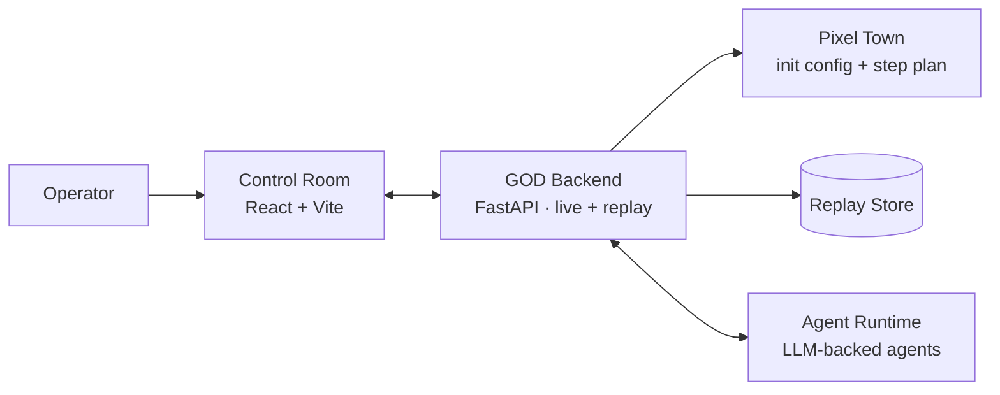

<h1 align="center">
  
  GOD · Govern · Observe · Direct
</h1>

<p align="center">
  
</p>

<p align="center">
  <b>面向 Agent 社会实验的实时控制台。</b><br/>
  在像素小镇里实时观察 LLM Agent，给任意一个 Agent 提问，逐步引导整个模拟。
</p>

<p align="center">
  <a href="#-快速开始"><b>快速开始</b></a> ·
  <a href="#-亮点">亮点</a> ·
  <a href="#-核心能力">核心能力</a> ·
  <a href="#%EF%B8%8F-架构">架构</a> ·
  <a href="#%EF%B8%8F-roadmap">Roadmap</a> ·
  <a href="README.md">English</a>
</p>

<p align="center">
  
  
  
  
  
  
</p>

---

> 大多数 generative-agent 项目都在做更大的模拟、更好的 replay。
> **GOD 补上的是「操作台」这一层** —— 一个屏幕里就能暂停、提问、干预、重置一整个 LLM Agent 社会。

## ✨ 亮点

- 🎮 &nbsp;**像素小镇实时控制台**：任意 step replay，可暂停、加速、自动推进。
- 💬 &nbsp;**对 Agent 精准提问**：在 live session 里给某个居民或全镇发问题。
- 🎛️ &nbsp;**干预下一步**：把指令注入即将执行的 step，Agent 立刻响应。
- 🔄 &nbsp;**一键重置**：清掉旧 replay，重新开一个干净实验。
- 🧱 &nbsp;**本地、可改、单一配置**：一个 `.env`、一个脚本，不需要 Docker。

## 🖼️ 截图

<p align="center">
  
</p>

<p align="center"><sub>实时控制台：像素小镇、step 控制、定向提问、居民列表，全在一个界面。</sub></p>

## 🚀 快速开始

```bash
git clone https://github.com/XiaoLuoLYG/GOD.git
cd GOD
./scripts/god.sh start
```

首次运行会先打开 `/setup` 配置向导，不会立刻创建 live session。你可以在页面里配置模型、填写实验背景，让 GOD agent 生成实验草案，再编辑 agent profile / steps，最后保存为新的实验副本并启动。

| 变量 | 示例 |
| --- | --- |
| `GOD_LLM_API_KEY` | `sk-...` |
| `GOD_LLM_API_BASE` | `https://api.openai.com/v1` |
| `GOD_LLM_MODEL` | `gpt-5.4` |

任意 OpenAI 兼容接口都可以。启动完成后打开脚本打印的地址，例如：

```
http://127.0.0.1:5174/pixel-replay/god_town/1
```

完整步骤见 **[快速开始 →](QUICKSTART.zh-CN.md)**

## 🧩 核心能力

|     | 能力 | 解决什么 |
| --- | --- | --- |
| 🎬 | **Replay 控制** | 在 live 或回放里按 step 拖动、暂停、自动推进。 |
| 💬 | **定向提问** | 用自然语言向某个 Agent 或所有居民提问。 |
| 🎛️ | **Step 干预** | 给下一个 step 注入指令，立即生效。 |
| 🧪 | **实验配置向导** | 在浏览器里配置模型和背景设定，生成可编辑 agent profiles，再启动新实验副本。 |
| 🧼 | **重新开跑** | 一条命令清掉旧数据，重新种一个干净实验。 |
| 🗺️ | **像素小镇世界** | 地点、行为、消息、状态都是 replay 友好的结构化数据。 |
| 🛠️ | **单一配置** | 一个 `.env`、一个脚本，默认值已经够用。 |

## 🏗️ 架构



| 层 | 职责 |
| --- | --- |
| **Control Room** | React/Vite 控制台，负责 replay、ask、intervention、status。 |
| **Backend** | 本地 FastAPI，提供 live 和 replay API。 |
| **Pixel Town** | 像素小镇社会状态：地点、动作、消息、Agent 状态。 |
| **Agent Runtime** | 独立进程的 LLM Agent，通过本地 WebSocket 连接。 |

## ⚙️ 常用命令

```bash
./scripts/god.sh start      # 启动完整栈（可重复执行）
./scripts/god.sh configure  # 打开配置向导，创建新的实验副本
./scripts/god.sh restart    # 先干净停止，再重新启动
./scripts/god.sh new-run    # 清掉 replay 数据，开一个新的 session
./scripts/god.sh status     # 查看端口、URL、模型状态
./scripts/god.sh stop       # 停止所有服务
./scripts/god.sh tail       # 跟随日志
./scripts/god.sh open       # 在浏览器里打开控制台
```

## 🧪 默认实验

```text
god_town
├── 10 个有不同人设的居民
├── 一个像素小镇：房子、路径、广场
└── 一份可在任意 step 介入的脚本化计划
```

如果你要跑自己的实验，把新的 config 放到 `quick_experiments/`，让 `GOD_EXPERIMENT` 指过去就行。

## 🛣️ Roadmap

- [ ] 在同一个控制台里跑多个小镇实验
- [ ] 每个 step 的操作员笔记
- [ ] 可插拔的地图清单
- [ ] 公开 demo

有想法？欢迎来 issue 和 PR 聊。

## 🤝 参与开发

```bash
./scripts/god.sh start
```

会自动装好 Python、Node 依赖，启动完整栈，创建 live session，并先跑完第 1 步，让控制台打开时就是已初始化的小镇。改完代码刷新即可。

## 🙌 致谢

GOD 站在开源社区的肩膀上。仓库内集成了两份精简上游代码：

- [AgentSociety](https://github.com/tsinghua-fib-lab/AgentSociety) — 大规模 generative-agent 模拟框架。
- [JiuwenClaw](https://github.com/openJiuwen-ai/jiuwenclaw) — 进程外 Agent runtime。

同时受 [Generative Agents](https://arxiv.org/abs/2304.03442) 与 [OASIS](https://github.com/camel-ai/oasis) 启发。

## 📚 引用

```bibtex
@article{piao2025agentsociety,
  title   = {AgentSociety: Large-Scale Simulation of LLM-Driven Generative Agents Advances Understanding of Human Behaviors and Society},
  author  = {Piao et al.},
  journal = {arXiv preprint arXiv:2502.08691},
  year    = {2025}
}

@misc{park2023generativeagents,
  title         = {Generative Agents: Interactive Simulacra of Human Behavior},
  author        = {Joon Sung Park and Joseph C. O'Brien and Carrie J. Cai and Meredith Ringel Morris and Percy Liang and Michael S. Bernstein},
  year          = {2023},
  eprint        = {2304.03442},
  archivePrefix = {arXiv},
  primaryClass  = {cs.HC},
  url           = {https://arxiv.org/abs/2304.03442}
}
```

## ⭐ Star History

<a href="https://star-history.com/#XiaoLuoLYG/GOD&Date">
  <picture>
    <source media="(prefers-color-scheme: dark)" srcset="https://api.star-history.com/svg?repos=XiaoLuoLYG/GOD&type=Date&theme=dark" />
    <source media="(prefers-color-scheme: light)" srcset="https://api.star-history.com/svg?repos=XiaoLuoLYG/GOD&type=Date" />
    
  </picture>
</a>

## 📄 License

[Apache-2.0](LICENSE)。集成的上游代码各自保留了它们的 LICENSE / NOTICE，对应子树仍受其约束。

<p align="center"><sub>用心做的项目。点一个 ⭐ 会让 GOD 长得更快。</sub></p>
